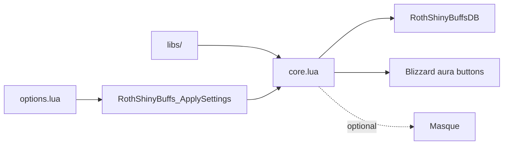

# Code graph

```mermaid
flowchart LR
  Libs[libs/] --> Core[core.lua]
  Core --> DB[RothShinyBuffsDB]
  Core --> AuraButtons[Blizzard aura buttons]
  Options[options.lua] --> Apply[RothShinyBuffs_ApplySettings]
  Apply --> Core
  Core -. optional .-> Masque[Masque]
```
