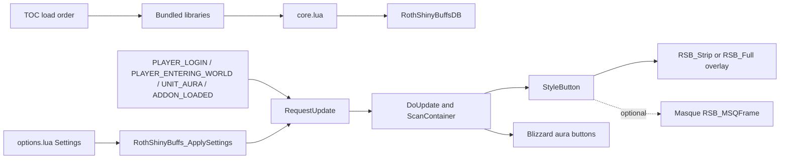

# Code graph

```mermaid
flowchart LR
  TOC[TOC load order] --> Libs[Bundled libraries]
  Libs --> Core[core.lua]
  Core --> DB[RothShinyBuffsDB]
  Events[PLAYER_LOGIN / PLAYER_ENTERING_WORLD / UNIT_AURA / ADDON_LOADED] --> Request[RequestUpdate]
  Request --> Scan[DoUpdate and ScanContainer]
  Scan --> Style[StyleButton]
  Style --> Local[RSB_Strip or RSB_Full overlay]
  Style -. optional .-> Masque[Masque RSB_MSQFrame]
  Options[options.lua Settings] --> Apply[RothShinyBuffs_ApplySettings]
  Apply --> Request
  Scan --> Blizzard[Blizzard aura buttons]
```
