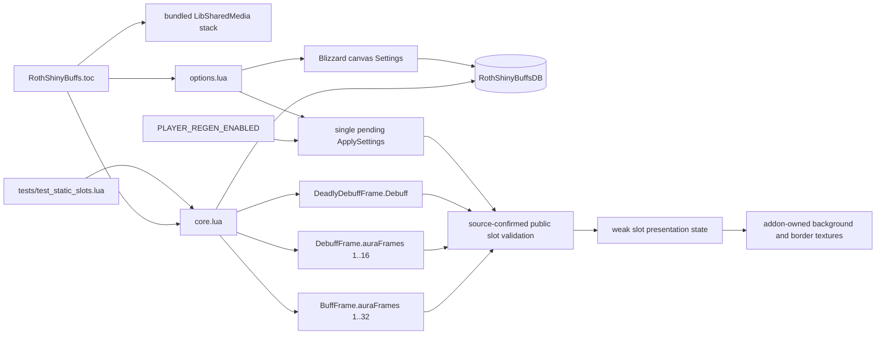

# RothShinyBuffs code graph

```mermaid
flowchart LR
  T["RothShinyBuffs.toc"] --> L["bundled LibSharedMedia stack"]
  T --> C["core.lua"]
  T --> O["options.lua"]
  C --> DB[("RothShinyBuffsDB")]
  C --> B["BuffFrame.auraFrames 1..32"]
  C --> D["DebuffFrame.auraFrames 1..16"]
  C --> DD["DeadlyDebuffFrame.Debuff"]
  B --> S["source-confirmed public slot validation"]
  D --> S
  DD --> S
  S --> W["weak slot presentation state"]
  W --> A["addon-owned background and border textures"]
  R["PLAYER_REGEN_ENABLED"] --> P["single pending ApplySettings"]
  P --> S
  O --> CS["Blizzard canvas Settings"]
  CS --> DB
  O --> P
  X["tests/test_static_slots.lua"] --> C
```

Aura assignment, visibility, pools, private anchors, duration, tooltip and layout remain Blizzard-owned and are not inputs to the addon graph.
